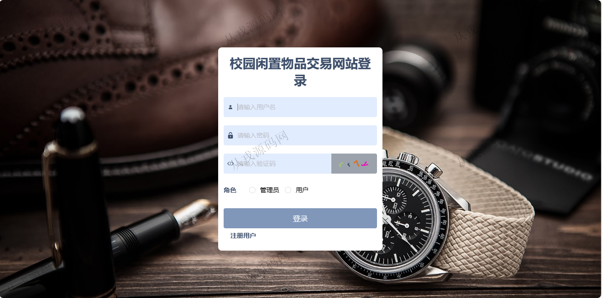
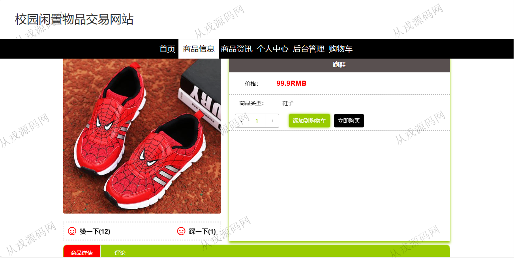
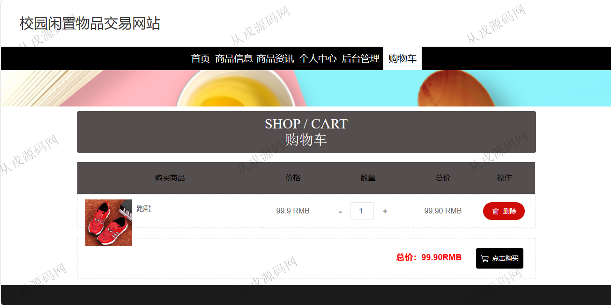
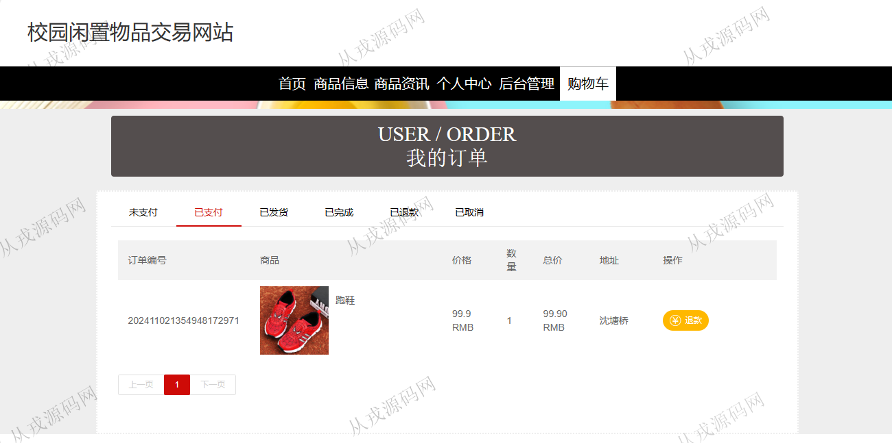
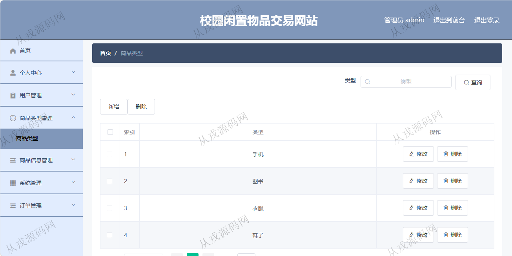
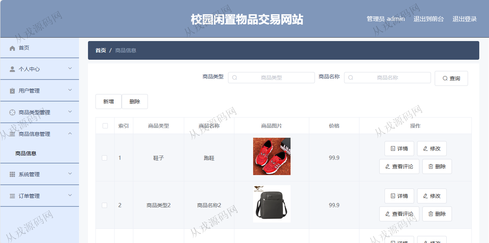
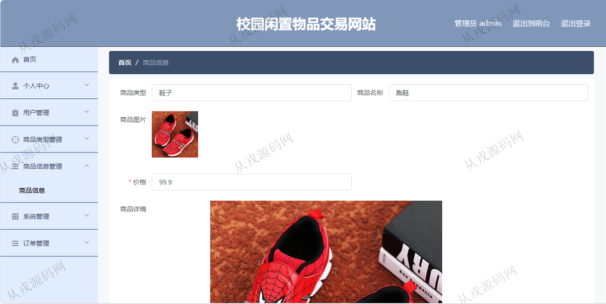

<h1 align="center">140.校园闲置物品交易系统</h1>

 获取sql文件 QQ: 386869957 QQ群: 377586148 

 [更多源码项目: 从戎源码网](https://armycodes.com/) 

## 简介

> 本代码来源于网络,仅供学习参考使用!
>
> 提供1.远程部署/2.修改代码/3.设计文档指导/4.框架代码讲解等服务
> 
> 用户端访问地址：http://localhost:8080/springboota6jgt/front/index.html
> 
> 用户：user 123456
>
> 管理后台访问地址：http://localhost:8080/springboota6jgt/admin/dist/index.html#/index
> 
> 管理员：admin 123456
>

## 项目介绍
基于springboot+vue的校园闲置物品交易系统：前端 vue、elementui，后端 maven、springmvc、spring、mybatis；角色分为管理员、用户；集成商品信息展示、购物车，在线支付，订单查询等功能于一体的系统。

## 功能介绍

### 用户

- 基本功能：登录、注册、退出
- 网站首页：主导航栏，轮播图，商品信息推荐，商品资讯
- 商品购买：商品信息展示，商品详情，商品搜索，收藏，评论，购物车，在线支付
- 个人中心：个人信息查看与修改，我的订单（未支付、已支付、已发货、已完成、已退款、已取消），收货地址增删改查，我的收藏

### 管理员

- 用户管理：前台用户注册的用户数据，管理员查看与删除
- 商品类型管理：商品类型的增删改查
- 商品管理：商品信息的增删改查，图片上传，查看商品评论
- 系统管理：轮播图的增删改查（对应用户端首页轮播图的展示），商品资讯的增删改查，商品资讯按标题模糊查询
- 订单管理：用户在前台购买商品的下单数据，管理员查看订单信息，发货操作

## 环境

- <b>IntelliJ IDEA 2021.3</b>

- <b>Mysql 5.7.26</b>

- <b>Node 14.14.0</b>

- <b>JDK 1.8</b>

## 运行截图

